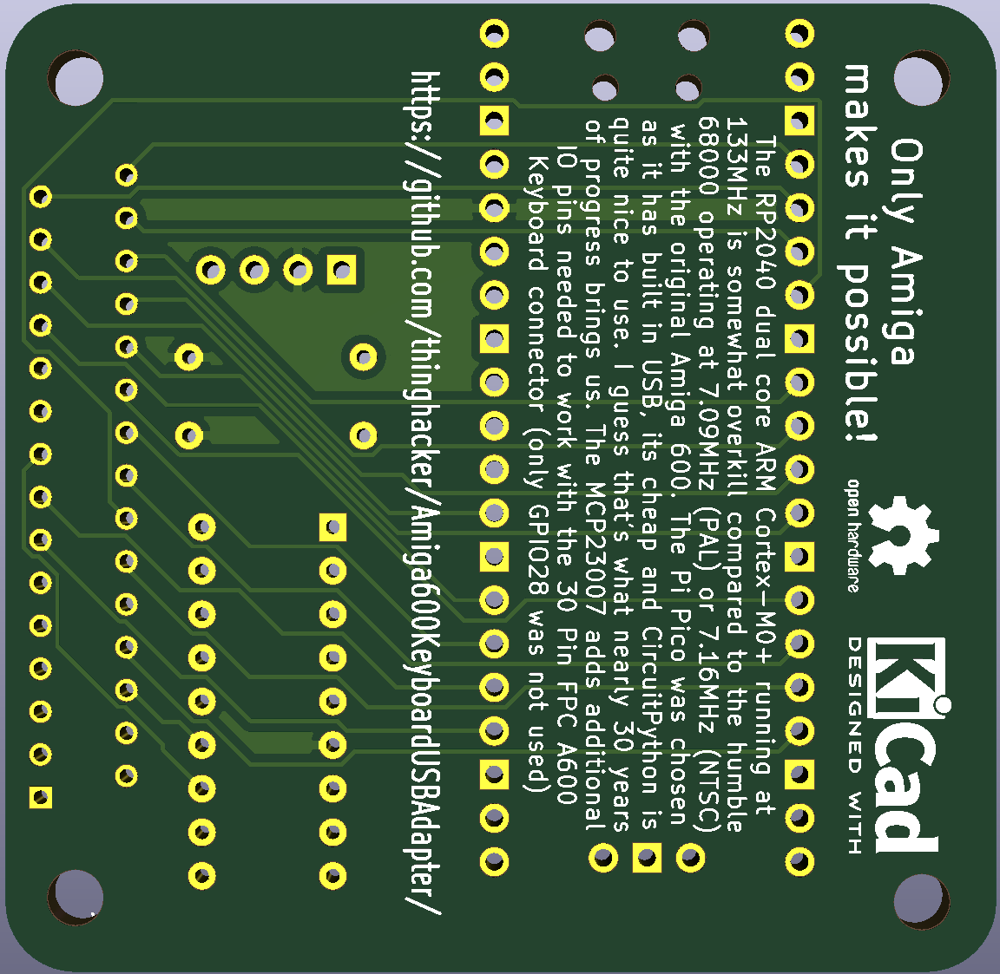

# Amiga600 Keyboard USB Adapter Using a Raspberry Pi Pico and MCP20008
This Kicad 5.1.10 project enables an existing Amiga 600 Keyboard to be USB enabled via a Raspberry Pi Pico and MCP20008 with the appropriate firmware such as [This CircuitPython Firmware](https://github.com/thinghacker/Amiga600KeyboardUSBAdapter/tree/main/CircuitPythonCode-Amiga600Keyboard_USB_Pico)

The hardware design open and distributed under a GPL Version 3 License

[Here is a PDF of the schematic for reference](schematic.pdf)

Gerbers have already been generated and are present in the "plot" directory

