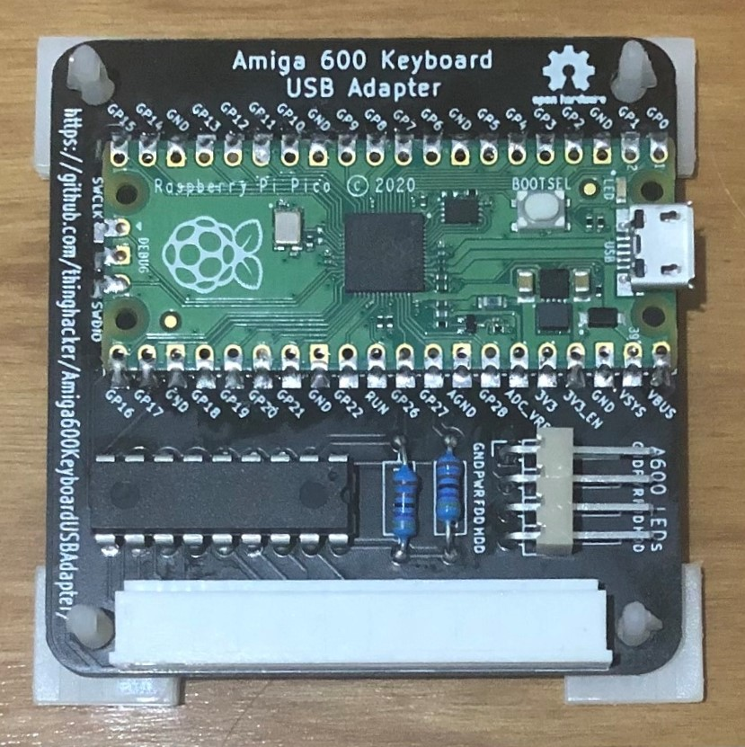
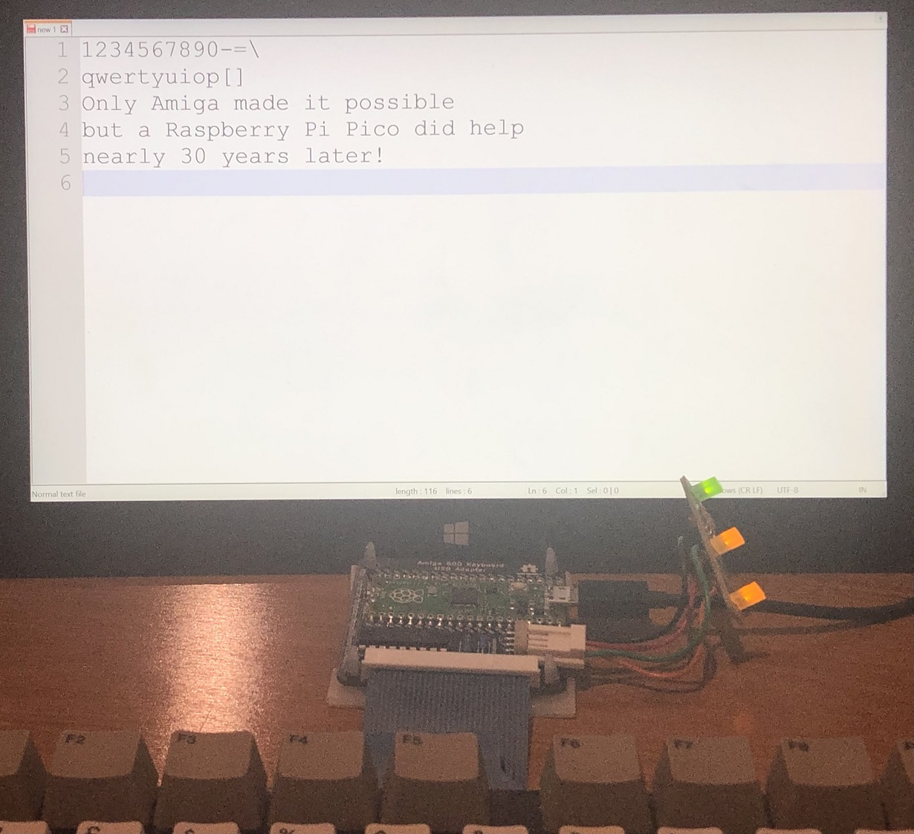

# Amiga600 Keyboard USB Adapter
This project enables an existing Amiga 600 Keyboard to operate as a USB Keyboard with the Case LEDs to indicate power/scroll lock and numlock.
This is a reimplementation of my previous [Teensy 2.0++ based PCB](https://github.com/thinghacker/amiga600_usb_pcb) and [QMK Firmware](https://github.com/thinghacker/qmk_firmware/tree/amiga600/keyboards/amiga600) adapter however as the Teensy 2.0++ is approaching end of sales availability and is relatively expensive,
this recreation uses the Raspberry Pi Pico in combination with a MCP20008 IO Expander for the keyboard interface and the keyboard driver software written in [CircuitPython](https://circuitpython.org/)

The [Kicad](https://www.kicad.org/) files used to create the PCB are in the [PCB-Amiga600Keyboard_USB_Pico](PCB-Amiga600Keyboard_USB_Pico/) directory - generated gerbers are the **plot** directory
The CircuitPython code is in the [CircuitPythonCode-Amiga600Keyboard_USB_Pico](CircuitPythonCode-Amiga600Keyboard_USB_Pico/) directory

Please note that the code requires the following libraries in addition to the base CircuitPython Install 
* [Adafruit_CircuitPython_HID](https://github.com/adafruit/Adafruit_CircuitPython_HID)
* [Adafruit_CircuitPython_MCP230xx](https://github.com/adafruit/Adafruit_CircuitPython_MCP230xx)

### Bill of Materials

|Designation              | Item    | Description | Manufacturer|
| ------------ | ------------ |------------ | ---------- |
| U1 | Raspberry Pi Pico | RP2040 Board with USB Connector | https://www.raspberrypi.org/products/raspberry-pi-pico/ | 
| U2 | MCP20008 | 8 bit I2C IO Expander | https://www.microchip.com/wwwproducts/en/MCP23008 | 
|J1|30 Pin FPC Connector 1.25mm spacing| Connects to the Amiga 600 Keyboard Ribbon|Molex 39532304|
|J2|4 Pin Header Right Angle PCB Mount 2.54mm spacing|Connects to Amiga 600 Case LEDs|Sullins Connector Solutions SWR25X-NRTC-S04-RB-BA available from Jaycar as HM3424|
|R1 & R2 |4K7 Ohm Resistor|Pullups for I2C|various|

### PCB
This is a fairly simple two layer through hole design.  There are holes in the PCB to accomodate 3mm Nylon standoffs, self-adhesive types mean you can attach it to the back of the keyboard if desired.

Assembled Prototype PCB

Assembled Prototype PCB connected to a Keyboard

### Construction Notes
This PCB does not require any advanced soldering skills, it may be best to work with an experienced friend or watch some youtube videos on build techniques if you don't feel confident.

The hardware and software as written by me is distributed under a GPL Version 3 License

No claims to the name or any trademarks associated with Amiga, Raspberry Pi, Pico or Tim Tam are asserted here.
